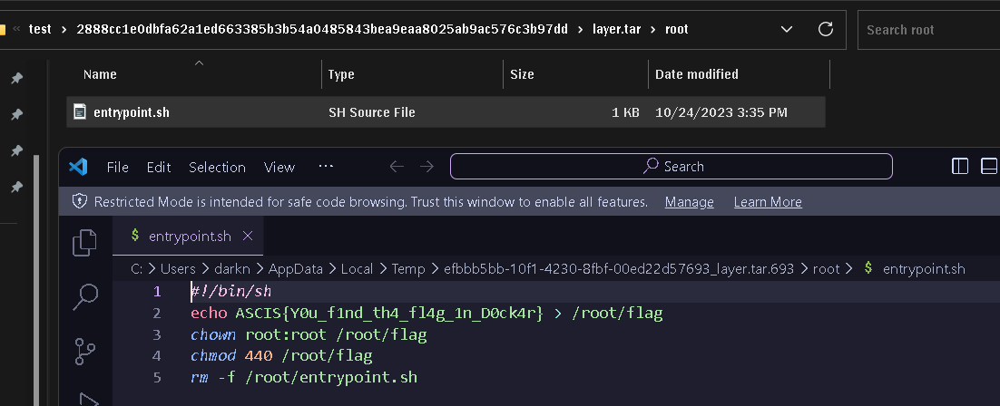

# For 2

* Bài này ban đầu cho một docker image để download về và chạy


* Bài này được viết giống ý tưởng của một challenge cũ: https://ctftime.org/writeup/31439

* Check history của image thì được các thông tin như này:


* Sử dụng **history** để xem lại líchwr thay đổi của image (tương tự như xem lại các commit của github)
```bash
sudo docker history todhudson1006/ascisfor 
```


* Ta thấy chỉ có 1 image hiện tại **017f54b0dc63** là dump được, vậy dump nó về để lục thông tin.
```bash
sudo docker save 017f54b0dc63 > save.tar
```

* Giả sử tác giả sẽ copy file vào docker, ta sẽ dùng lệnh **find** để lướt qua các file sau đó đưa file vào **grep** để tìm flag.
```bash
find . -exec grep -lr "ASCIS{" {} \;
```


* Mở từng file tương ứng ra và đọc nội dùng tìm flag.



