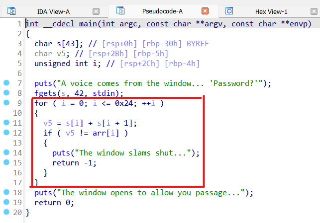
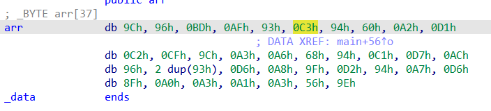
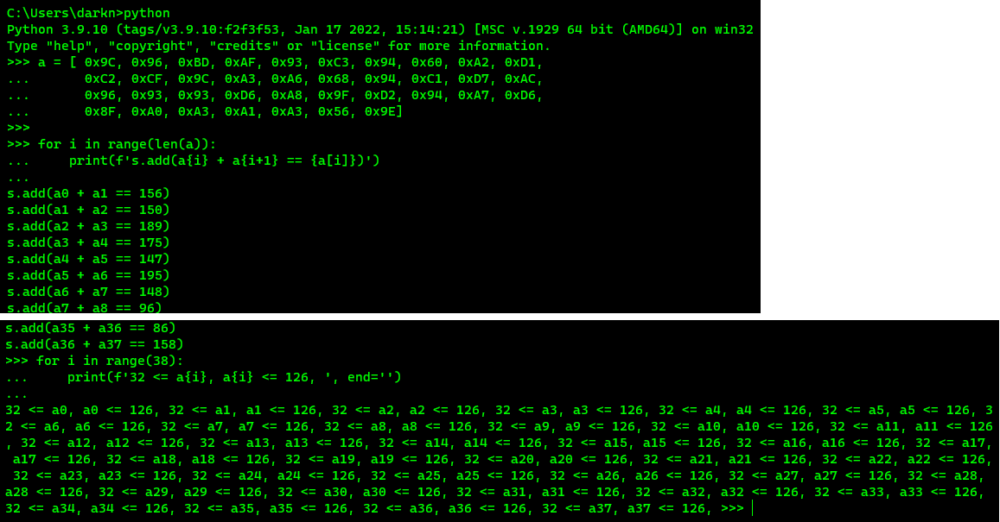
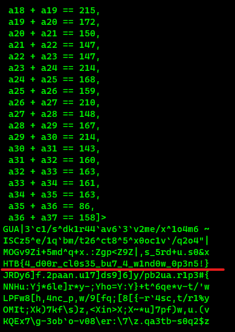
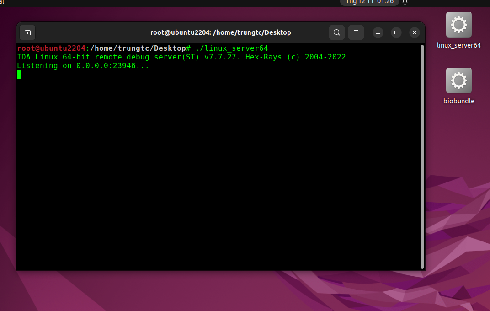
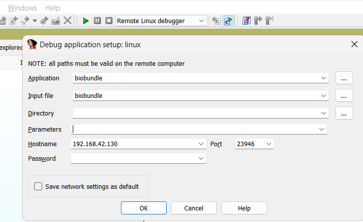
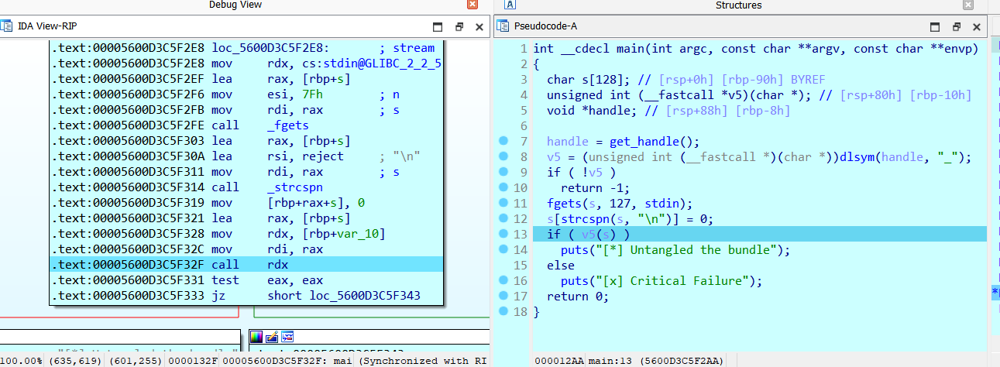
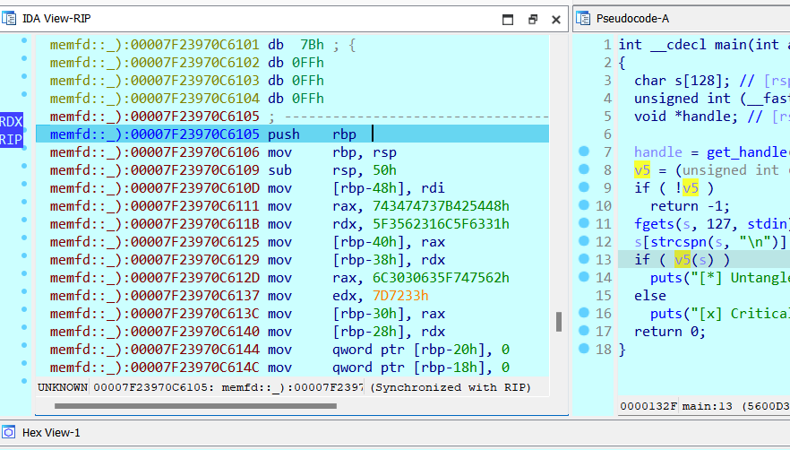
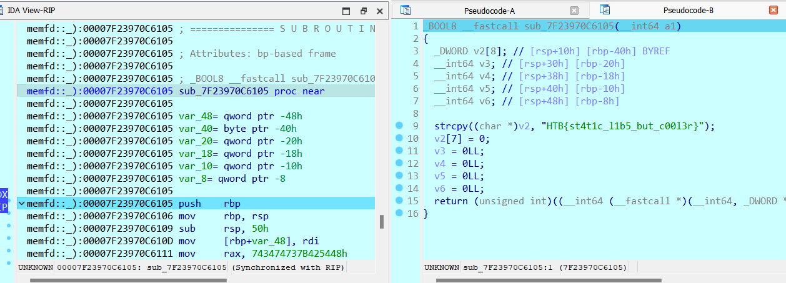

# [__Windows Of Opportunity__](#WindowsOfOpportunity)

Bài này đúng với phân loại của nó, chỉ nằm ở mức easy tập làm quen.

Mới vào chúng ta sẽ được cho 1 file exe, decompiler sẽ được đoạn code


Đoạn code này sẽ cho phép nhập tối đa 42 kí tự.

Sau đó sẽ chạy 1 vòng for check 38 kí tự với phép tính 

```
s[i] + s[i+1] == arr[i]
```

với **arr** là mảng có sẵn (để export được nó, ta click trỏ chuột vào biến **arr**, sau đó *Shift-E* để export data và chọn kiểu xuất dữ liệu phù hợp.


Nhìn chung, nó sẽ ra được 1 dạng các biểu thức 
```
s1 + s2 == arr_1
s2 + s3 == arr_2
s3 + s4 == arr_3
...
```

Để giải những biểu thức này thì chỉ đơn giản là dùng thư viện *z3-solver* thôi.

Nhưng trước tiên, ta cần tạo script chứa những biểu thức này đã

[createz3.py](./WindowsOfOpportunity/createz3.py)
```python
# createz3.py
a = [ 0x9C, 0x96, 0xBD, 0xAF, 0x93, 0xC3, 0x94, 0x60, 0xA2, 0xD1,
	  0xC2, 0xCF, 0x9C, 0xA3, 0xA6, 0x68, 0x94, 0xC1, 0xD7, 0xAC,
	  0x96, 0x93, 0x93, 0xD6, 0xA8, 0x9F, 0xD2, 0x94, 0xA7, 0xD6,
	  0x8F, 0xA0, 0xA3, 0xA1, 0xA3, 0x56, 0x9E]

for i in range(len(a)):
	print(f's.add(a{i} + a{i+1} == {a[i]})')

for i in range(38):
	print(f'32 <= a{i}, a{i} <= 126, ', end='')
```


Và đây là file giải flag
[solve.py](./WindowsOfOpportunity/solve.py)



Hoặc dùng code ngắn hơn từ BTC:
```python
from z3 import *
s = Solver()

inp = [BitVec(f"flag_{i}", 8) for i in range(len(sums) + 1)]
for i, c in enumerate(b"HTB{"):
    s.add(inp[i] == c)
for i in range(len(sums)):
    s.add(inp[i] + inp[i+1] == sums[i])

print(s.check())
m = s.model()
bs = [m.eval(i).as_long() for i in inp]
print(bytes(bs))
```

# [__Bio Bundle__](#BioBundle)

Bài này chỉ cần setup remote debug từ trình IDA Windows sang môi trường máy ảo Unix để debug là xong (Hoặc đơn giản là cài Radare2 trên Linux VM và debug :))

Mở file ELF bằng IDA, chọn **Remote Linux debugger**

Chạy file **linux_server64** trong máy ảo Unix để mở port chờ và thông kết nối. (nên để file trình dbgsrv và file challenge cùng 1 chỗ cho tiện lúc setup)



Sau đó sửa debug setup (File > Debugger > Process Options) để trỏ đến máy ảo (của mình là 192.168.42.130) (đường dẫn của Application, Input file là trỏ đến file cần debug, tính từ vị trí hiện 


Đọc code, ta thấy nó chạy hàm **get_handle()** rồi **dlsym()** để làm gì đó, cơ mà mình lười nên dí luôn vào cái hàm check **v5()** tại vì sau khi nó chạy sẽ ra 2 output 1 thành công 1 fail :)



Vì là hàm tạo mới nên vào đến đây chỉ có code chứ chưa được analyze, ta cần tạo Function cho nó (đặt trỏ tại đầu hàm và nhấn P), sau đó F5 để decompile.



Và sau khi vào đến đây may mắn là nó so sánh với flag luôn :)



Đọc cách giải đúng cho bài này tại [đây](https://github.com/hackthebox/uni-ctf-2023/blob/main/uni-ctf-2023/rev/%5BMedium%5D%20BioBundle/README.md)