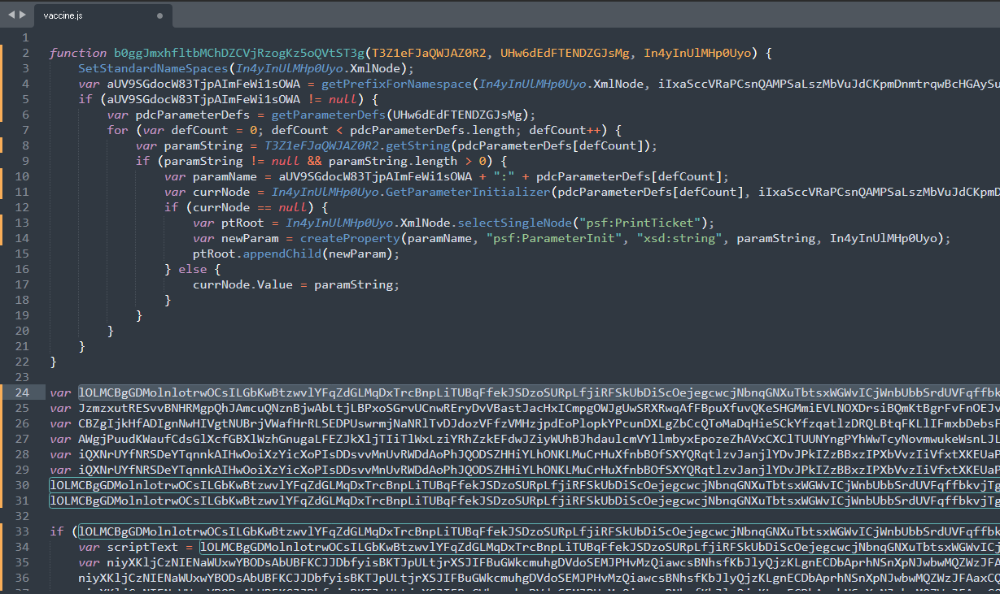
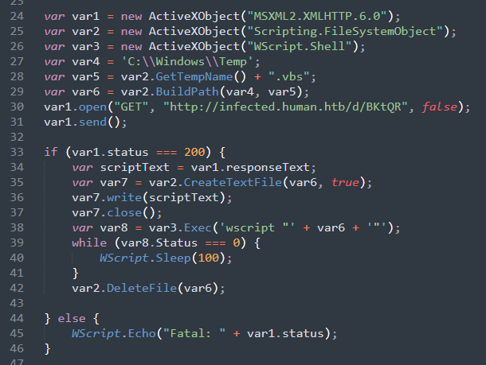
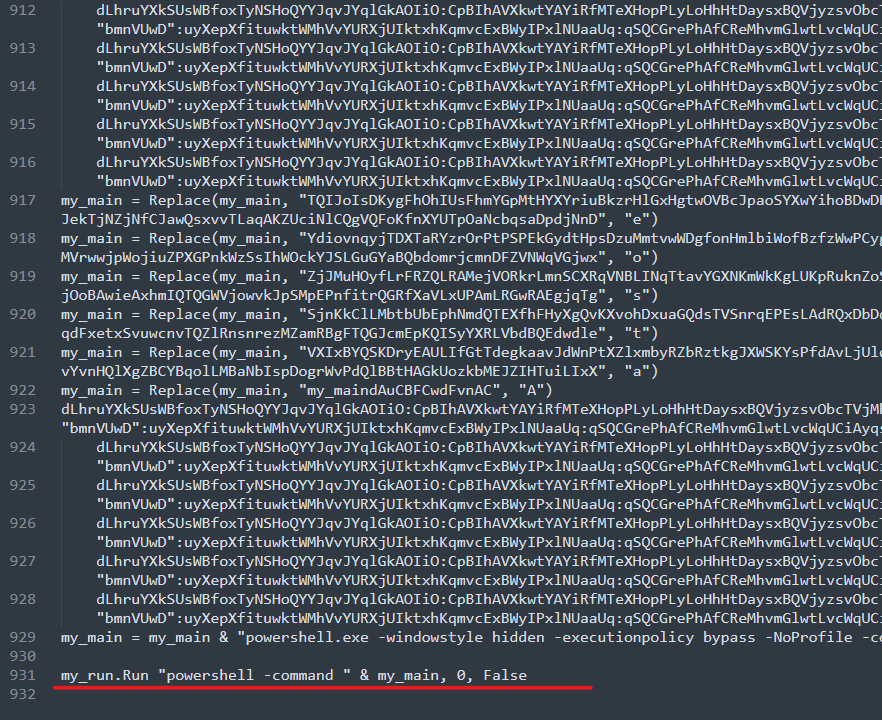
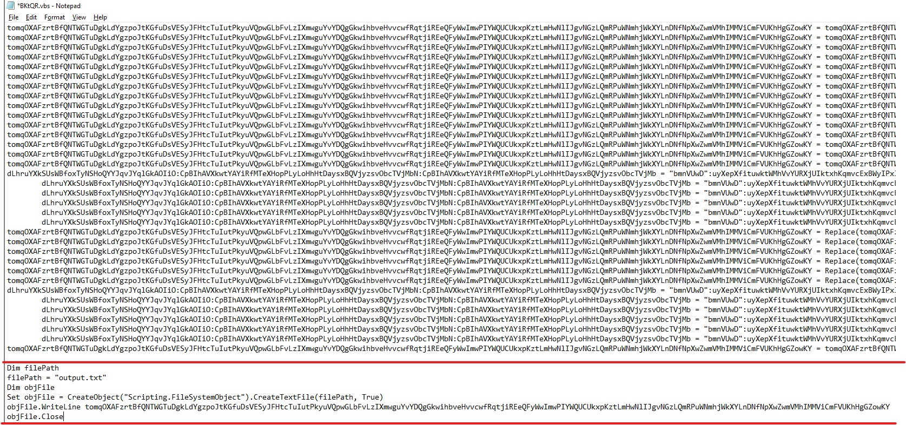
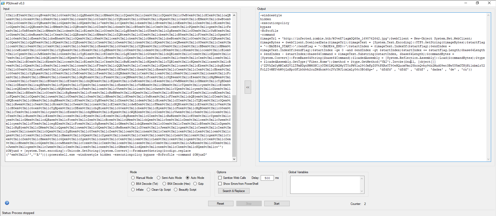
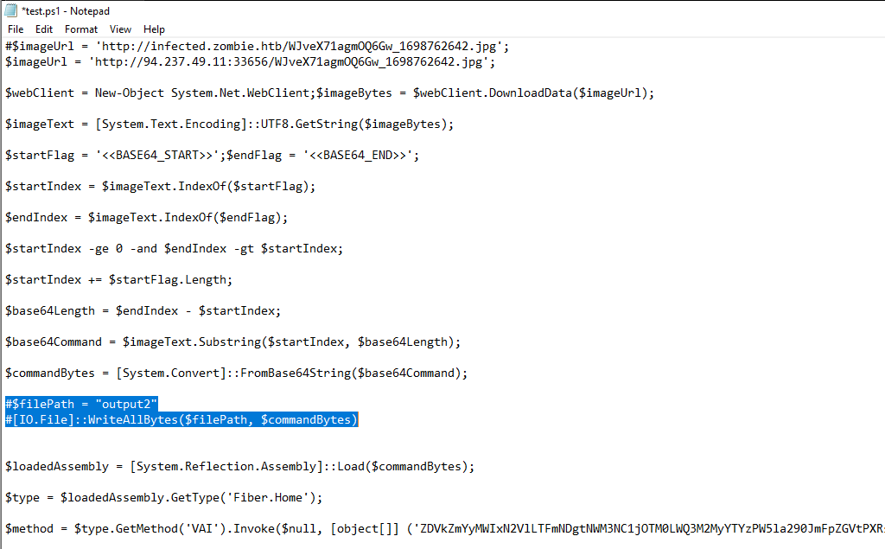
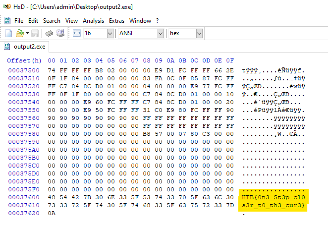

# [__One Step Closer__](#OneStepCloser)

Đề bài cho ta file js đã được gây rối

Để đọc được cần phải dùng editor để thay các biến có tên dài thành các biến ngắn gọn và thấy được 1 hàm nghi vấn, dùng để download file BKtQR xuống, sau đó dùng **wscript** để chạy file **.vbs** đó

Sau khi tải xong, ta lại thấy file vừa được tải đã được sử dụng **Replace obfuscation technique** để làm rối mã. Đến cuối cùng, nó sẽ được deobfuscate thành powershell ở cuối.

Cách dễ dàng nhất để giải quyết vấn đề này đó chính là xóa đoạn thực hiện powershell đi, cứ thế mà để cho nó chạy và in ra đoạn mã bị làm rối. (**Lưu ý** chỉ thực hiện cách này khi thay thế hoàn toàn các đoạn Run powershell)

Sau khi được gỡ rối, đoạn mã được ghi vào output.txt, ta đem nó nhờ [PSUnveil](https://www.kahusecurity.com/posts/introducing_psunveil.html) giải quyết hộ thôi.

Tại đây, ta thấy nó download xuống 1 file hình ảnh, decode bởi base64 thành 1 file gì đó và thực thi. Mình đã thêm 2 dòng để nó ghi binary thành file và phân tích.

Cuối cùng, mình đã ngồi phân tích file .NET exe đến hết giờ mà không thu được flag. Cho đến khi có write-up thì mới biết là nó lại nằm ở cuối .NET exe đó (Xin lỗi team vì sự gà ỉa này) 

**NOTE**: Dùng search để tìm format của flag ở bất cứ data nào sau khi đã được decode, decrypt :)

