# Ransomware

### 1. Approaching

* Trong digital forensic, memory của máy được dump ra và thưởng được lưu dưới định dạng RAW.

* Định dạng này có thể dùng tool đơn giản nhất để xử lý và bóc tách thông tin đó là [Volatility](https://github.com/volatilityfoundation/volatility) (gg tìm Volatility DFIR Cheatsheet để lấy cheatsheet)

### 2. Analyzing

* Trước tiên, sử dụng `kdbgscan` để xác định format OS của máy.
```shell
vol.py -f mydump.raw kdbgscan
```
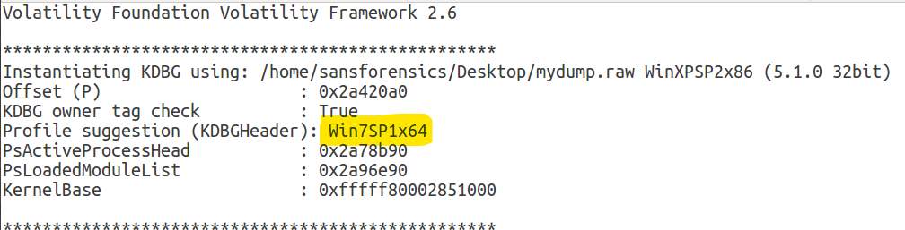

* Sau đó có thể bắt đầu đi vào phân tích.

#### Process analyze

* Dấu hiệu phổ biến, dễ tiếp cận nhất của một ransomware là đi tìm process của nó. Vì nó cần duy trì hoạt động và gửi kết nối về cho Hacker.

	+ Dùng `psscan`, `pslist`, hay `pstree` cũng được, tuy nhiên ưu tiên dùng `pstree` để nhìn được luồng thực thi của một process (ai gọi nó, nó sinh ra các process nào sau đó)

	```shell
	vol.py -f mydump.raw --profile=Win7SP1x64 pstree
	```

	+ Tại đây ta thấy được có nhiều process trông rất sú.
	+ Ta thấy được người dùng đã mở file *invoice.pdf.exe* vào lúc 2022-11-22 11:07:22 UTC+7, sau đó nó tự khởi chạy 1 loạt các process *@WanaDecryptor*... trông rất giống wannacry.
	+ Đây là chiến thuật *phising* phổ biến trong Social Engineering khi hacker chèn mã độc vào các file văn bản hoặc fake file thực thi cho giống với file văn bản để lừa người dùng mở.
	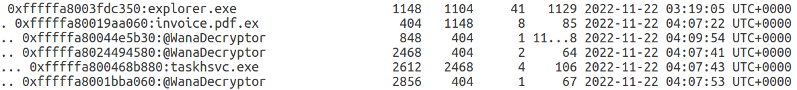

	+ Có thể thấy *invoice.pdf.exe* là nguồn cơn của mọi chuyện vì không có tiến trình nào sus khác ==> Trả lời được phần 3 của câu hỏi.
	+ Đánh dấu những dấu hiệu này lại và lần theo dấu vết.
 
#### Source

* 11:07 chỉ là thời gian file đó được mở, mà ta cần tìm rõ xem là file này xuất hiện từ khi nào, ở đâu, tại sao.

* Trong windows log có một trường thông tin dùng để xác định timing một file được tạo ra hoặc bị động chạm, đó là **MFT Time**

	+ Sử dụng option `mftparser` để lấy ra các thông tin về timing của tất cả file

	```shell
	vol.py -f mydump.raw --profile=Win7SP1x64 mftparser | grep invoice
	```

	+ Tại đây thấy được toàn bộ các file được *invoice.pdf.exe* giải nén ra sau khi chạy và và chính nó 

	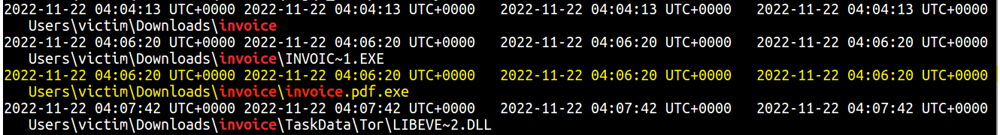

	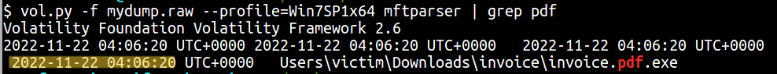

	==> Lấy được time xuất hiện của mã độc, 2022-11-22 11:06:20 UTC+7, trả lời được câu hỏi thứ 1.

	+ Một thông tin bên lề không liên quan đó là ta cũng có thể xác định được nguồn gốc của file này.

	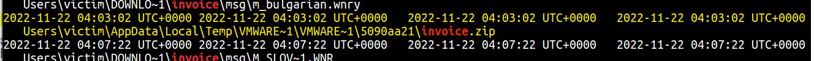

	+ Khi user thực hiện thao tác copy một file vào máy ảo. File này trước tiên được copy vào thư mục tạm thời của VMWare, sau đó mới di chuyển đến vị trí đích. Vì vậy ảnh này cho thấy tác giả bắt đầu thực hiện copy vào lúc 11:03:02.

#### Persistence

* Đặc trưng của một malware là sẽ tìm các duy trì sự tồn tại của nó vào hệ thống để cho dù người dùng có tìm ra process bất thương cũng không thể loại bỏ hoàn toàn được chúng.

* Bước đầu tiên là tìm các để ransomware có thể tự khởi động khi có người sử dụng máy tính.

* Có rất rất nhiều các để làm được điều này (tham khảo tại [đây](https://attack.mitre.org/tactics/TA0003/)), tuy nhiên con malware này chỉ áp dụng phương pháp rất đơn giản là sử dụng **Registry Run Keys**

	+ Để hiểu được mã độc nó đã làm gì thì phải phân tích nó. 
	
	+ Ta đã có memory của máy ở đây rồi. Một process khi muốn chạy thì cần phải load các câu lệnh của bản thân nó vào bộ nhớ máy tính trước đã.
	+ Vì vậy về cơ bản là đã có toàn bộ file *invoice.pdf.exe*, chỉ cần dump nó ra là được.

	+ PID của process độc là *404*, sử dụng option `memdump0`:

	```shell
	vol.py -f mydump.raw --profile=Win7SP1x64_24000 memdump -p 404 --dump-dir=./
	```

	+ Sau đó dùng lệnh `strings` (thông thường như khi rev :D) để xem có chuỗi gì thú vị không.

	```shell
	strings -a -t d -e l 4
	```

	+ Skip nhanh qua bước search theo các dấu hiệu [persistence](https://attack.mitre.org/tactics/TA0003/)), ta thấy chiến thuật [Registry Run Keys](https://attack.mitre.org/techniques/T1547/001/) xuất hiện trong process, vì vậy khả năng cao nó được sử dụng.

	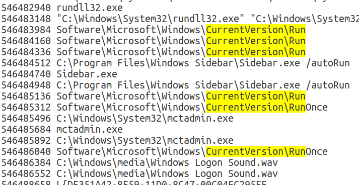

	+ Trace theo các registry cho phép tạo file chạy tự động khi mở máy thường được dùng:
		```
		+ HKEY_LOCAL_MACHINE\Software\Microsoft\Windows\CurrentVersion\Run
		+ HKEY_LOCAL_MACHINE\Software\Microsoft\Windows\CurrentVersion\RunOnce
		+ HKEY_CURRENT_USER\Software\Microsoft\Windows\CurrentVersion\Run
		+ HKEY_CURRENT_USER\Software\Microsoft\Windows\CurrentVersion\RunOnce
		```

	+ Sử dụng option `hivelist` để lấy được virtual address của chỗ chứa registry key

	```shell
	vol.py -f mydump.raw --profile=Win7SP1x64 hivelist
	```
	
	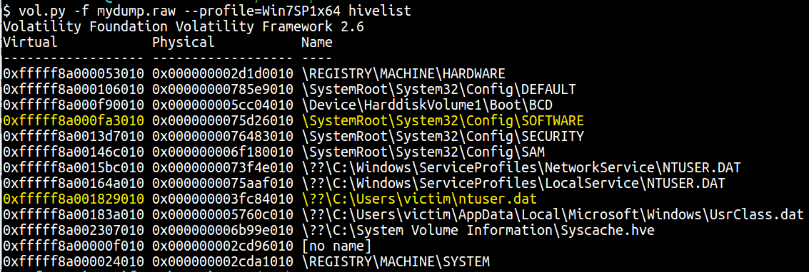
	
	```
	HKLM\Software\ ==> \SystemRoot\System32\Config\SOFTWARE
	HKCU\          ==> \??\C:\Users\victim\ntuser.dat
	```

	+ Dùng option `printkey -o -K` để lấy regítry key value.

	```shell
	#HKEY_LOCAL_MACHINE\Software\Microsoft\Windows\CurrentVersion\Run

	vol.py -f mydump.raw --profile=Win7SP1x64 printkey -o 0xfffff8a000fa3010 -K "Microsoft\Windows\CurrentVersion\Run"
	```
	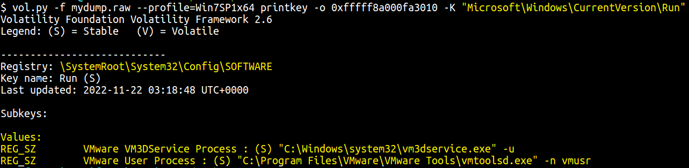

	```shell
	#HKEY_LOCAL_MACHINE\Software\Microsoft\Windows\CurrentVersion\RunOnce

	vol.py -f mydump.raw --profile=Win7SP1x64 printkey -o 0xfffff8a000fa3010 -K "Microsoft\Windows\CurrentVersion\RunOnce"
	```
	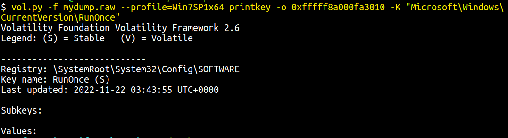

	```shell
	#HKEY_CURRENT_USER\Software\Microsoft\Windows\CurrentVersion\Run

	vol.py -f mydump.raw --profile=Win7SP1x64 printkey -o 0xfffff8a001829010 -K "Software\Microsoft\Windows\CurrentVersion\Run"
	```
	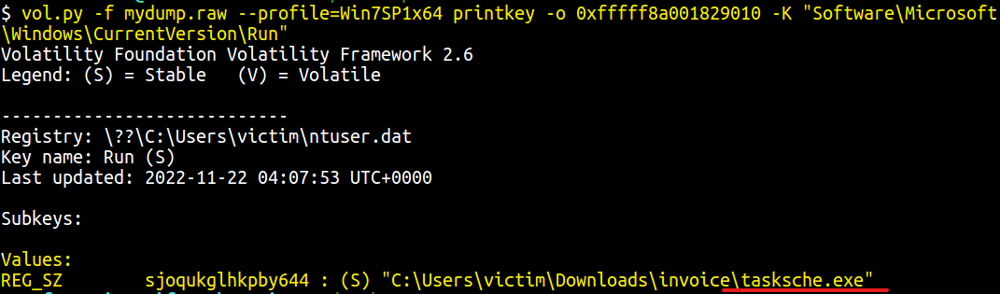

	```shell
	#HKEY_CURRENT_USER\Software\Microsoft\Windows\CurrentVersion\RunOnce

	vol.py -f mydump.raw --profile=Win7SP1x64 printkey -o 0xfffff8a001829010 -K "Software\Microsoft\Windows\CurrentVersion\RunOnce"

	```
	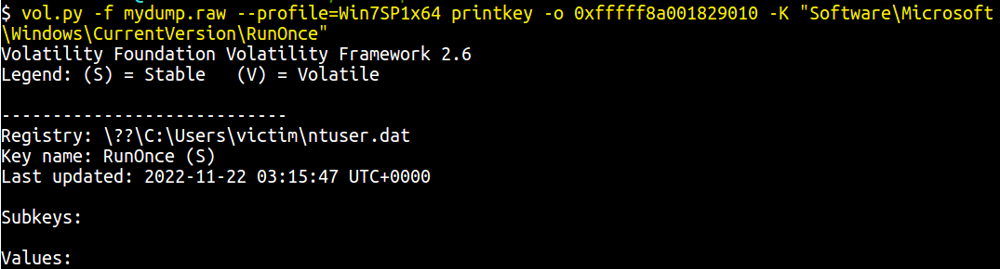

* ==> Tìm được persistence của mã độc là *tasksche.exe*

#### ghép 3 cái lại, flag là 
	ISITDTU{2022-11-22_11-06-20_tasksche.exe_invoice.pdf.exe}


