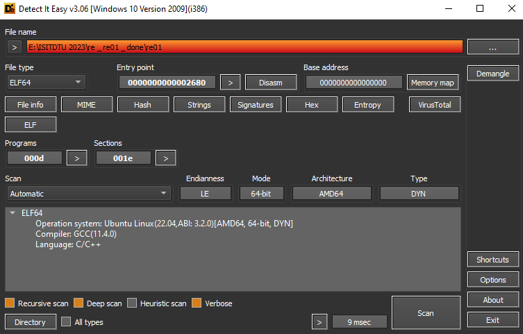

# RE01

### 1. Approaching

* Điều đầu tiên khi làm bài thì mình sẽ chạy thử chương trình, bỏ vào Detect it easy trong bộ **retoolkit** để xem nó là file gì, x64 hay x86.



* Sau khi được load vào IDA thì mình dùng **Shift+F12** để tìm toàn bộ Strings trong file xem có file nào sus không và trace theo, đánh dấu nó từ đó.


* Tiếp đến trace xem chỗ nào nhận input của người dùng và vẽ lại đường đi từ đó đến chỗ "Congrat.


### 2. Analyze

* Phân tích lần lượt từ hàm main, ta sẽ thấy 
	+ một đoạn giá trị được define. Theo kinh nghiệm của mình thì cứ đặt debug ngay sau đoạn define để lấy được giá trị của array đó, có thể sẽ có tác dụng sau này (Nhớ sửa lại tên cho dễ nhớ).

	+ Chuỗi string sẽ cần 25 kí tự


	+ Các hàm bên dưới cũng không có liên quan gì đến *input* cả, thế nên thôi kệ, cứ **F8** để nó chạy qua cái hàm rồi xem kết quả là gì. Kết quả trả ra là bảng giá trị số nguyên tố (cố định).

	+ Hàm mình cần quan tâm đó là *sub_2AA8* vì nó chứa dòng message "Congrat" thôi.


* Phân tích nhanh hàm checker, ta thấy 
	+ Để thỏa mãn được cout >> "Congrat" phải đi qua một bước so sánh *v18* với array cố định được gán ban đầu.

	+ Mà trước đó array *v18* (kèm với *inp* và *prime* đã được xử lý qua hàm *sub_2769*), chính vì thế cần phân tích hàm này.


	+ Tổng quan, hàm này dùng để nhân *input* và *prime* lại với nhau, sau đó cộng vào output (là array *v18* hay *out_enc* hay *enc_inp*)


	+ Có thể thấy được trong công thức ở trên, ```shell enc_inp += prime * inp```, *enc_inp* và *prime* là cố định và có thể dùng nó để tìm ngược lại inp. Tuy nhiên cần phải tìm ra quy luật các phép tính.

### 3. Coding

* Đầu tiên, chạy lại hàm và tìm ra quy luật của nó

``` python
enc  0  prime  0  input  0
enc  0  prime  5  input  1
enc  0  prime  10  input  2
enc  0  prime  15  input  3
enc  0  prime  20  input  4
enc  1  prime  1  input  0
enc  1  prime  6  input  1
enc  1  prime  11  input  2
enc  1  prime  16  input  3
enc  1  prime  21  input  4
enc  2  prime  2  input  0
enc  2  prime  7  input  1
enc  2  prime  12  input  2
enc  2  prime  17  input  3
enc  2  prime  22  input  4
...
```

	+ Suy ra mỗi *enc_inp* sẽ được tính bằng một biểu thức

```python
enc[0] = prime[0]*input[0] + prime[5]*input[1] + prime[10]*input[2] + prime[15]*input[3] + prime[20]*input[4]
```

	+ ==> Dùng Z3-Solver để giải.

	+ File [temp.txt](./temp.txt) để lưu các biểu thức, gán luôn các giá trị *prime* vào.

```
a0 * 2 
a1 * 13 
a2 * 31 
a3 * 53 
a4 * 73 
a0 * 3 
a1 * 17 
a2 * 37 
a3 * 59 
a4 * 79 
...
```

	+ Để cho nhanh và gọn thì code một hàm để gen ra các biểu thức cần giải. 

```python
enc = [0x43AD, 0x4CFC, 0x52A8, 0x5AA2, 0x651C, 0x4881, 0x5203, 0x57DF, 0x6043, 0x6B51, 
        0x49C6, 0x538F, 0x5975, 0x6231, 0x6D6B, 0x42DC, 0x4C10, 0x51AC, 0x59B8, 0x6448, 
        0x1F63, 0x2475, 0x27C9, 0x2C8D, 0x333F]
def second_stage():
    cnt = 0
    with open('temp.txt',"r") as f:
        for i in range(0,25):
            s = 's.add('
            s += f.readline().strip() + ' + '
            s += f.readline().strip() + ' + '
            s += f.readline().strip() + ' + '
            s += f.readline().strip() + ' + '
            s += f.readline().strip()        
            s += f" == {enc[cnt]})"
            print(s)
            cnt += 1
#stage_two()
```

	+ Output:


	+ Sau đó cài đặt z3 để cho nó tự chạy ra flag thôi (giới hạn kí tự trong ascii).

```python
from z3 import *

n = 25
s = Solver()

for i in range(n):
    globals()['a%d' % i] = BitVec('a%d' % i, 8)

s.add(32 <= a0, a0 <= 126, 32 <= a1, a1 <= 126, 32 <= a2, a2 <= 126, 32 <= a3, a3 <= 126, 32 <= a4, a4 <= 126, 32 <= a5, a5 <= 126, 32 <= a6, a6 <= 126, 32 <= a7, a7 <= 126, 32 <= a8, a8 <= 126, 32 <= a9, a9 <= 126, 32 <= a10, a10 <= 126, 32 <= a11, a11 <= 126, 32 <= a12, a12 <= 126, 32 <= a13, a13 <= 126, 32 <= a14, a14 <= 126, 32 <= a15, a15 <= 126, 32 <= a16, a16 <= 126, 32 <= a17, a17 <= 126, 32 <= a18, a18 <= 126, 32 <= a19, a19 <= 126, 32 <= a20, a20 <= 126, 32 <= a21, a21 <= 126, 32 <= a22, a22 <= 126, 32 <= a23, a23 <= 126, 32 <= a24, a24 <= 126)

s.add(a0 * 2 + a1 * 13 + a2 * 31 + a3 * 53 + a4 * 73 == 17325)
s.add(a0 * 3 + a1 * 17 + a2 * 37 + a3 * 59 + a4 * 79 == 19708)
s.add(a0 * 5 + a1 * 19 + a2 * 41 + a3 * 61 + a4 * 83 == 21160)
s.add(a0 * 7 + a1 * 23 + a2 * 43 + a3 * 67 + a4 * 89 == 23202)
s.add(a0 * 11 + a1 * 29 + a2 * 47 + a3 * 71 + a4 * 97 == 25884)
s.add(a5 * 2 + a6 * 13 + a7 * 31 + a8 * 53 + a9 * 73 == 18561)
s.add(a5 * 3 + a6 * 17 + a7 * 37 + a8 * 59 + a9 * 79 == 20995)
s.add(a5 * 5 + a6 * 19 + a7 * 41 + a8 * 61 + a9 * 83 == 22495)
s.add(a5 * 7 + a6 * 23 + a7 * 43 + a8 * 67 + a9 * 89 == 24643)
s.add(a5 * 11 + a6 * 29 + a7 * 47 + a8 * 71 + a9 * 97 == 27473)
s.add(a10 * 2 + a11 * 13 + a12 * 31 + a13 * 53 + a14 * 73 == 18886)
s.add(a10 * 3 + a11 * 17 + a12 * 37 + a13 * 59 + a14 * 79 == 21391)
s.add(a10 * 5 + a11 * 19 + a12 * 41 + a13 * 61 + a14 * 83 == 22901)
s.add(a10 * 7 + a11 * 23 + a12 * 43 + a13 * 67 + a14 * 89 == 25137)
s.add(a10 * 11 + a11 * 29 + a12 * 47 + a13 * 71 + a14 * 97 == 28011)
s.add(a15 * 2 + a16 * 13 + a17 * 31 + a18 * 53 + a19 * 73 == 17116)
s.add(a15 * 3 + a16 * 17 + a17 * 37 + a18 * 59 + a19 * 79 == 19472)
s.add(a15 * 5 + a16 * 19 + a17 * 41 + a18 * 61 + a19 * 83 == 20908)
s.add(a15 * 7 + a16 * 23 + a17 * 43 + a18 * 67 + a19 * 89 == 22968)
s.add(a15 * 11 + a16 * 29 + a17 * 47 + a18 * 71 + a19 * 97 == 25672)
s.add(a20 * 2 + a21 * 13 + a22 * 31 + a23 * 53 + a24 * 73 == 8035)
s.add(a20 * 3 + a21 * 17 + a22 * 37 + a23 * 59 + a24 * 79 == 9333)
s.add(a20 * 5 + a21 * 19 + a22 * 41 + a23 * 61 + a24 * 83 == 10185)
s.add(a20 * 7 + a21 * 23 + a22 * 43 + a23 * 67 + a24 * 89 == 11405)
s.add(a20 * 11 + a21 * 29 + a22 * 47 + a23 * 71 + a24 * 97 == 13119)

print(s.model)

while s.check() == sat:
    model = s.model()
    block = []
    flag = ''

    for i in range(n):
        c = globals()['a%d' % i]
        flag += chr(model[c].as_long())

        block.append(c != model[c])

    s.add(Or(block))
    
    print(flag)
```


